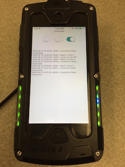

# Controlling The LED Array #

This is a sample iOS application demonstrating the control of LED arrays on a Infinite Peripherals device that uses the DTDevices SDK. This example was developed using the Infinea X.

## Getting Started ##

* Clone the repository 

```
$ git clone https://github.com/jdkelley/InfinitePeripherals-iOS.git
```

* Open up the infineax-leds project in Xcode.
* Add Dependencies
    * If you do not have a developer account with Infinite Peripherals, [create one](https://developer.ipcmobile.com/).
    * [Download](https://developer.ipcmobile.com/downloads/?showcat=Infinea) the latest version of the DTDevices SDK under "Infinea X."
    * Open the example's Xcode project file.
    * Drag the libdtdev.a file from SDK's Library directory to the Library group in the example's Xcode project.

* Build and run the project.

## How it works ##

The SDK controls the LED arrays by passing a bit mask (as a ```UInt32```) to the ```uiControlLEDsWithBitMask``` instance method on the ```DTDevices``` object.

The bit mask is a three bit bit mask where the first bit controls the green LED array, the second bit controls the red LED array, and the third bit controls the blue LED array. The follow diagram illustrates this. 
  
  
  
To turn on the green LED arrays, pass 001 to ```uiControlLEDsWithBitMask```.
  
  

Likewise, to turn on the blue LED arrays, pass 100 to ```uiControlLEDsWithBitMask```. 
  
  
  
Because all three LED arrays are independent and nearly on top of each other, you can use a superposition of these Red, Green, and Blue color states to simulate other colors. For example, passing 011 (or 3) will turn on the red array and the green array resulting in a color close to orange. 
  
  
  
Simply passing 0 to ```uiControlLEDsWithBitMask``` will turn off the LEDs.

Resulting illuminated LEDs having passed 001 to ```uiControlLEDsWithBitMask```:

  

Note: There is a blue LED lit because the onboard sled speaker is on. 

## License ##

This Example is released under the [MIT License](http://www.opensource.org/licenses/MIT).

The Infinite Peripherals SDK is proprietary and we do not claim to grant license.
